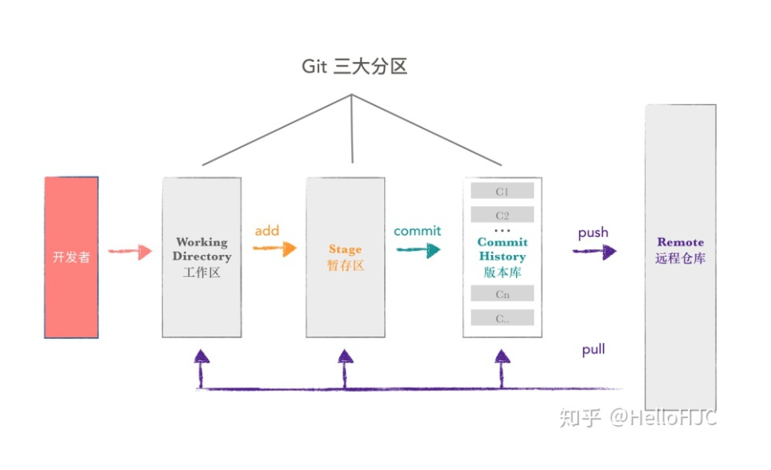

# Git学习

## Git层次关系

## 时光回退

#### 版本回溯

​	git commit 会提交一次又一次仓库内修改文件的版本，如果我们把文件改乱了，或者误删了，还可以从最近的一个commit(存档)回盘，就类似于打游戏，boss没打过，死了，还可以回到打boss前存的档。两个字，方便~

​	历史记录可以用指令 git log查看(如果觉得输出信息太多，可以加上 --pretty=oneline 参数)。

​	同时，在历史记录中看到的一大串很长的字母数字组合是commit id(版本号)，用十六进制表示。

​	在git中，HEAD表示当前版本，版本回溯的前提是必须知道当前版本是哪个版本。上个版本就是HEAD^ ，上上个版本就是HEAD^^，当版本过旧时，可以用~代替^，例：HEAD~100。

​	注意：版本回溯后，先前的最新版本会在git log 中消失，所以要回到先前的最新版本，需要根据版本号去回溯，并且版本号无需写全（写多几位，以免询查多个版本），git会自动查找。

​	实质：git内部有个指向当前版本的指针，所谓版本回溯，其实是Git内部指针指向的改变。

#### 工作区和暂存区

1.工作区（Working Directory）就是电脑中能看到的目录，例如自己设定的project目录。

2.版本库（Repository）工作区中的隐藏目录.git，不算是工作区，而是Git的版本库。

​	其中存储了许多东西，最重要的是称为stage的暂存区，还有Git自动创建的第一个分支master，以及一个指向master的指针HEAD

3.文件往Git版本库内添加分两步（A. git add 实质上是把文件修改添加到暂存区。B.git commit 是提交更改，把当前暂存区的所有东西提交到当前分支）

4.Git跟踪并管理的是文件的修改，而非文件，这是Git的一大优点。

#### 管理修改

1.第一次修改 -> git add -> 第二次修改 -> git commit -> 第二次没有提交

​	原因:文件修改没有经过暂存区，git提交的只有在暂存区内的修改

2.正解 第一次修改 ->git add -> 第二次修改 -> git add ->git commit ->第二次修改成功

3.每次修改，如果不用git add传到暂存区，就不会加入到commit中去。

#### 撤销修改

1.撤销修改 git checkout -- <文件名>可分为两种情况： A. 文件修改后还没有放到暂存区，此时撤销修改会回到跟版本库一模一样的状态。 B. 文件添加到暂存区后，又作了修改，现在撤销修改就会回到文件添加到暂存区后的状态。

2.注意：-- 起到很重要的作用，如果没有 -- 此命令就变成了切换到另一分支的命令。

3.当对文件的修改已经add到暂存区时，可以用git reset HEAD <文件名> 此时可知，git reset不仅是可以回退版本，同时可以将暂存区的修改回退到工作区，再用git checkout -- <文件名>将工作区的修改撤销，完成整个撤销过程。

4.当对文件的修改已经add到暂存区，并且commit到版本库时，可以通过版本回退git reset来回退到上一版本，前提是没有推送到远程版本库。

#### 删除文件

1.直接在文件管理器把没用的文件删除

2.使用rm命令

3.删除后 git status会告诉你哪些文件被删除了 此时有两个选择A.git rm+git commit 这样文件会在版本库中删除；B.git checkout -- <文件名> 此时是误删的情况，用该命令可以轻松把文件恢复到最新版本。

## 分支

#### 仍在学习中···

## 远程仓库

#### 添加远程库

## Git的常见指令

1. git add<文件名> : 把目标文件添加进仓库。

2. git commit -m <message>: 把目标文件提交到仓库 (-m后输入的是本次提交的说明 可输入任意内容)。

3. git init : 初始化一个Git仓库 。

4. git status : 获取仓库当前状态(是否被修改等等)。

5. git diff : 查看修改前后的内容(diff = difference)。

6. git log : 查看历史版本(可加--pretty=oneline参数 使信息呈一行表示)

7. git reset --hard : 回退版本

8. git reflog : 记录你的每一条命令，查找版本号的一种方式。

9. git checkout -- <文件名>  : 把文件在工作区的修改全部撤销（有两种情况，看撤销修改部分） 实质是用版本库的版本替代工作区的版本，无论工作区是修改还是删除都可以一键还原。

10. rm <文件名> : 删除文件

10. git clone : 克隆库

10. git push origin : 将暂存区的内容提交到远程仓库

    

    

    