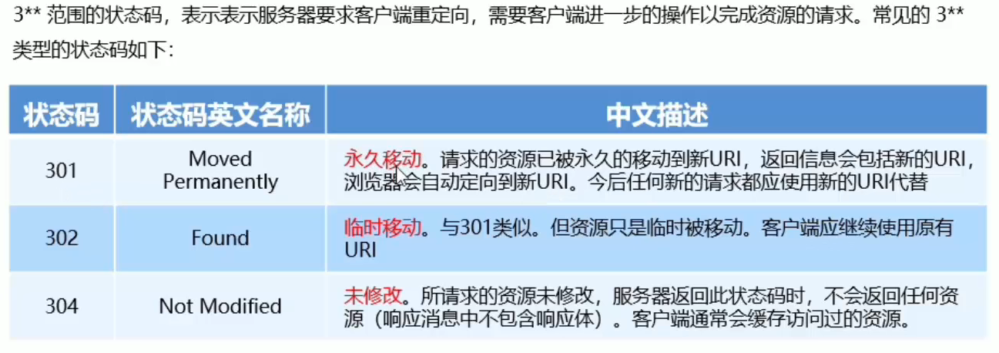

# HTTP学习

#### 学习目标

1、什么是HTTP协议

2、知道HTTP请求信息的组成部分

3、知道HTTP响应消息的组成部分

4、掌握常见的请求方法

5、掌握常见的响应状态码

#### HTTP简介

HTTP协议 超文本传输协议 (HyperText Transfer Protocol)

通信三要素 ：主体、内容、方式

HTTP协议采用了 请求/响应 的交互模型

#### HTTP请求

简介：客户端发送到服务器端的消息，称为HTTP请求消息（又叫HTTP请求报文）

HTTP请求报文组成：请求行（requestline）、请求头部（header）、空行和请求体四部分。

请求头部用来描述客户端的信息，从而达到把客户端相关的信息告诉服务器端。

请求头部常以键值对的方式组成，键与值之间用冒号分开。

常见的请求头部字段（更多的字段可以查阅MDN文档）：

请求空行：主要是分隔请求头部和请求体，放在请求最后一个头部字段的后面，告诉服务器请求头部到此结束。

请求体：请求体中存放的数据，是要以POST方式提交给服务器的数据。

请求体仅存在于POST方式中，GET方式中不存在请求体。

#### HTTP响应

简介：响应消息就是服务器响应给客户端的消息，也称HTTP响应报文。

HTTP请求报文组成：状态行、响应头部、空行和响应体四部分。

响应头部：用来描述服务器的基本信息，组成与请求头部基本相同。

常见的响应头部字段（需要更多可以查询MDN文档）：

空行：作用与请求报文中的空行一样。

响应体：响应体内存放的数据是显现给客户端的内容。可在Network中的response查看是否请求或相应成功。

#### HTTP的请求方法

常见的请求方法：POST and GET。

请求方法的作用：用于表明要对服务器上资源执行的操作。

请求方法（前四个为重点[增删改查]）：

#### HTTP响应状态码

简介：英文全称：HTTP Status Code，HTTP响应状态码用于标识响应的状态，且一般情况下后跟对该HTTP响应状态码的简要描述。

HTTP响应状态码的组成及分类：

细分各类状态码的效果：

##### 以2开头的响应状态码（成功相关）

1、200，表示请求成功。OK

2、201，表示已创建。Created

##### 以3开头的响应状态码（重定向相关）

1、301，表示永久移动请求的资源到一个新的URL。Moved Permanently

2、302，表示暂时移动请求的资源到一个新的URL，客户端继续使用原有资源。Found

3、303，未修改，不返回任何资源。Not Modified

##### 以4开头的响应状态码（客户端错误相关（前端））

1、400，表示语义有误（服务器无法理解）或请求的参数有误（输入错误）。Bad Request

2、401，表示当前的请求需要用户验证（大概就是类似于要知道你的身份？登录什么的）。Unauthorized

3、403，表示服务器收到并理解了请求，但拒绝执行你的请求（类似于教务管理系统的封禁？）。Forbidden

4、404，表示服务器无法根据客户端的请求找到资源（网页）。Not Found

5、408，表示请求超时（网卡）。Request Timeout

##### 以5开头的响应状态码（服务器错误相关（后台））

1、500，表示服务器内部错误。Internal Server Error

2、501，表示服务器不支持客户端的请求方法（例如不支持POST），并且只有GET和HEAD 请求方法是要求每个服务器都支持的。Not Implemented

3、503，表示服务器超载或者服务器维护，服务器暂时无法处理客户端的请求。Service Unavailable

# 小结

​			在HTTP协议的学习中，先了解了协议的含义，再从HTTP各部分去学习，明白了请求与响应报文的基本架构及掌握了请求与响应报文的基本阅读；学会了HTTP的请求方法，并认识了HTTP在网页中的各种响应状态码。个人理解基本学习HTTP协议主要还是以认识各种内容并能阅读网页中的报文为主。