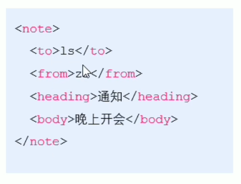
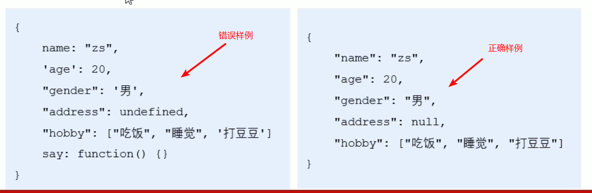
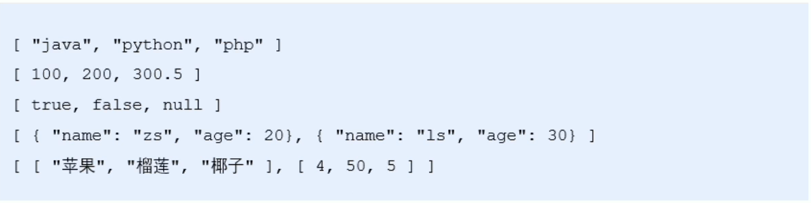
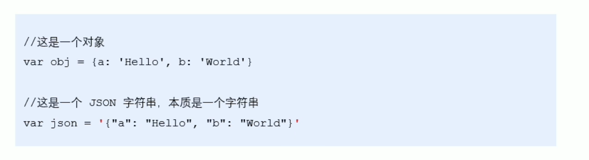
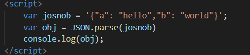
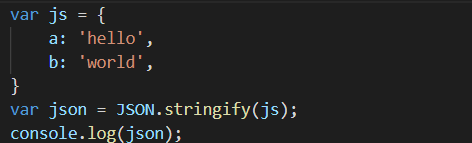
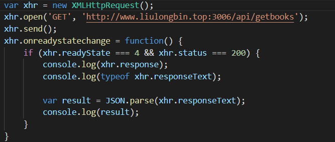

# JSON笔记

## 数据交换格式

​	学习JSON前，先认识数据交换格式，数据交换格式就是服务器端和客户端之间数据传输与交换的格式。数据交换格式分为两种：第一种是XML，第二种是JSON。又因为目前对于前端来说，XML使用频率比较低，所以我浅学一下XML数据交换格式，主要学习JSON数据交换格式。

## XML

#### XML简介

​	XML是一种拓展的标记语言，HTML是超文本标记语言，两者都是标记语言，并且从XML的代码格式可以知道，XML的代码语义化非常强，可以理解的很清楚想要表达的内容，下面上图 ->

#### XML和HTML的区别

​	两者不画等号，是截然不同的两种标记语言。

​	HTML编写的是网页内容，是网页内容的载体。

​	而XML编写的是传输和储存数据，是数据的载体。

​	两者没有任何的关系

#### XML的缺点

1、代码量会比内容更多，显得十分臃肿，会导致传输效率的降低

2、JavaScript中，解析XML十分麻烦（前端不用XML的原因之一）

## JSON

#### JSON简介

​	JSON全称（JavaScript Object Notation），中文为JavaScript 对象表示法。实质上可以说JSON是JavaScript对象和数组的字符串表示法（使用文本来表示一个js对象或js数组），所以JSON的本质是字符串。

​	JSON的作用：与XML是类似的，但是JSON是一个轻量级的文本数据交换格式，在计算机与网络之间传输和储存数据上，JSON是要比XML更快、更小、更易解析的，这也是选择JSON的原因之一。

#### JSON的两种结构

##### 对象结构

​	在JSON中，对象结构表现为{}括起来的内容，表现为{key: value, key:value,······}，需要注意的是，key必须是用""包裹起来的字符串，而value可以使数字、字符串、null、数组、对象、布尔值六种类型。

##### 数组结构

​	在JSON中，数组结构表现为[]括起来的内容，表现为["java",······]，数组内数据的类型可以为数字、字符串、布尔值、null、数组、对象六种类型。

#### JSON语法的注意事项

1、属性名必须是使用双引号包裹。"key"

2、字符串类型的值必须使用双引号包裹。"字符串"、"javascript"

3、JSON不同于JS，不允许使用单引号表示字符串。

4、JSON最外层必须是两种结构的其中一种。

5、JSON不能书写注释。

6、不能使用undefined或函数作为JSON的值。

#### JSON与JS对象的关系

​	JSON是JS的字符串表示法，实质上是用文本去表示JS对象的信息，且本质是一个字符串，两者的书写代码如下：

#### JSON与JS对象的互转

##### 	JSON转JS对象可使用JSON.parse()方法

实例：

​	

##### 	JS对象转JSON可用JSON.stringify()方法

实例:

##### 	JSON.parse的简单应用实例：

#### 序列化和反序列化

序列化：把数据对象转换为字符串的操作就叫做序列化，例如调用JSON.stringify()函数。

反序列化：把字符串转换为数据对象的操作就叫做反序列化，例如调用JSON.parse()函数。