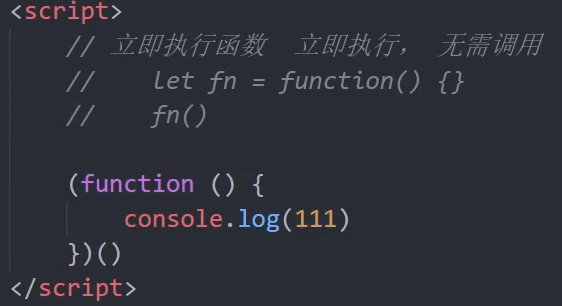

# 作用域与作用域链

## 分类

​	作用域可分为三种，分别是全局作用域、局部作用域和块级作用域

​	全局作用域的生命范围：作用于所有代码执行的环境（例如一个独立的js文件或者一个script内部）

​	局部作用域的生命范围：作用于函数内部的代码环境，也叫函数作用域。

​	块级作用域的生命范围：作用于｛｝内，例如for if等语句。

​	相对应有三种变量：全局变量，局部变量，以及块级变量

​	有一个坑：在函数内部或者块级作用域内部，如果变量没有声明，直接使用，是当做全局变量看待

​	但是函数内部的形参是可以看作局部变量的，外部调用会报错

## 作用域链

​	主要用于变量查找机制，内部函数可以访问外部函数变量这种机制，用链式查找去查找变量（就近原则）

## 匿名函数

​	函数分为具名函数和匿名函数，具名函数的写法类似普通函数 构建：function 函数名｛｝ 调用：函数名()；匿名函数 function（）｛｝，将匿名函数赋到一个变量上，要引用时引用变量即可（形参写在function中）

​	匿名函数的一个分支：立即执行函数（可用于页面预载或重载以及避免全局变量之间的污染），构建如下:

补充：第一个括号放的是形参，第二个括号放的是实参

补充：立即执行函数的另一种写法：（function 【第一个括号前面可以给函数名，也可以不给】（）｛｝（））

补充：多个立即执行函数之间必须加分号，一个立即执行函数必须要有结尾。

补充：现在点击事件多是用addEventListener来写，而不是onclick

## 	var、let、const区别

