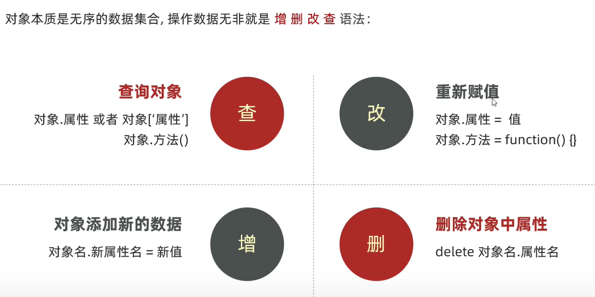

# 对象的进阶学习

## 目的

​	学会用对象存储多个数据，学会操作对象，学会遍历对象，学会使用内置对象

## 对象的介绍

### 对象声明语法

​	let 对象名 = ｛｝

### 对象组成

​	对象由属性和方法组成，其中属性是描述静态，方法是描述动态

​	let 对象名 = ｛

​			属性名 ：属性值，

​			方法名 ：函数

​	｝

​	补充：属性名不需要双引号引起来。

### 属性访问

​	第一种语法形式：对象名.属性名

​	第二种语法形式：对象名['属性名']

### 	方法访问

​	调用的语法形式：对象名.方法名（）

## 对象的操作与遍历

### 对象的操作

​	对于对象的操作无非四种：增删改查，跟后台工作类似

需要注意的是删，之前对删的应用甚少，删的语法为delete 对象名.属性名/方法名

### 对象的遍历

​	难点：对象不像数组一样有固定长度，无法从length获取当前长度、对象内的值都是无序的键值对，无下标